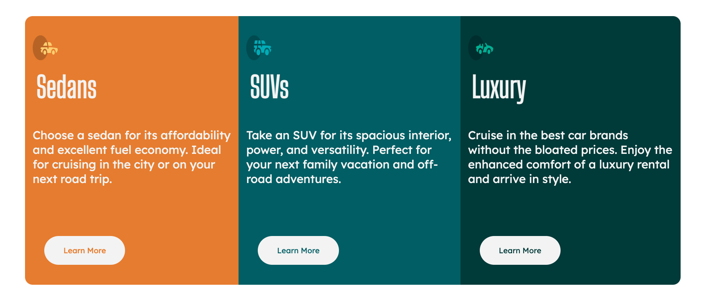

# Frontend Mentor - 3-column preview card component solution

This is a solution to the [3-column preview card component challenge on Frontend Mentor](https://www.frontendmentor.io/challenges/3column-preview-card-component-pH92eAR2-). Frontend Mentor challenges help you improve your coding skills by building realistic projects. 

## Table of contents

- [Overview](#overview)
  - [The challenge](#the-challenge)
  - [Screenshot](#screenshot)
  - [Links](#links)
  - [Built with](#built-with)
  - [What I learned](#what-i-learned)
- [Author](#author)
- [Acknowledgments](#acknowledgments)


## Overview

### The challenge

Users should be able to:

- View the optimal layout depending on their device's screen size
- See hover states for interactive elements

### Screenshot




### Links

- Solution URL: [Click here for code solution](https://github.com/UbaidRussell/3-column-preview-card-component)
- Live Site URL: [View the Live Site Here](https://ubaidrussell.com/3-column-preview-card-component/)


### Built with

- HTML
- CSS custom properties
- Flexbox
- Visual Studio Code


### What I learned
This CSS code was intersting to us and showed us we can do border radius specifically to the top, right, left or bottom of an element.
```css
.card-one{
    background-color: hsl(31, 77%, 52%);
    border: #5E5DF0;
    height: 700px;
    border-top-left-radius: 20px;
    border-bottom-left-radius:20px ;
}
```

## Author

- Website - [UbaidRussell.com](UbaidRussell.com)
- Frontend Mentor - [@UbaidRussell](https://www.frontendmentor.io/profile/UbaidRussell)
- Twitter - [@Ubaidussell](https://www.twitter.com/UbaidRussell)


## Acknowledgments
Shoutout to all the developers who created the tools for me to create and make this possible.